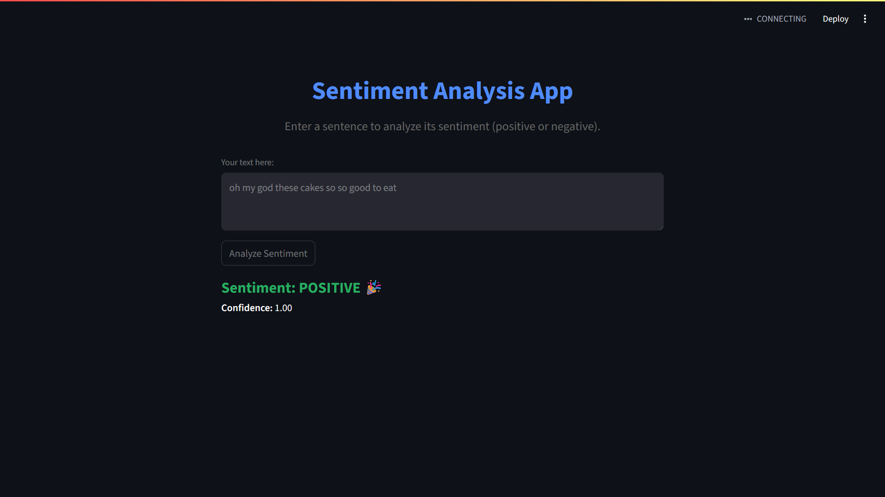

# Sentiment Analysis App

A simple sentiment analysis project built using Hugging Face Transformers and Streamlit. Analyze sentiment through a web interface, the command line, or batch processing.

## 🔍 Features

- **Streamlit Web App** (`main3.py`)  
  User-friendly interface to input text and get sentiment results instantly.
- **Command Line Tool** (`main2.py`)  
  Perform sentiment analysis directly from your terminal.
- **Batch Processing** (`main.py`)  
  Analyze multiple texts or CSV files using pandas.

---

## 🚀 Installation

1. **Clone the Repository**
   ```bash
   git clone https://github.com/subham-sharma21/Sentiment-Analysis.git
   cd llm
   ```
2. **(Optional) Create a Virtual Environment**
   ```bash
   python -m venv venv
   # On Windows:
   venv\Scripts\activate
   # On macOS/Linux:
   source venv/bin/activate
   ```
3. **Install Dependencies**
   ```bash
   pip install -r requirements.txt
   ```

---

## 📦 Usage

### 1. Streamlit Web App

Launch the web app:

```bash
streamlit run main3.py
```

Open [http://localhost:8501](http://localhost:8501) in your browser.

**Example Output:**



### 2. Command Line Tool

Run the command line tool:

```bash
python main2.py
```

Follow the prompts to enter text for sentiment analysis.

### 3. Batch Processing

Edit `main.py` to analyze lists of texts or CSV files:

```bash
python main.py
```

See comments in the script for usage examples.

---

## 📁 File Structure

```
main.py        # Batch sentiment analysis (single, list, or CSV)
main2.py       # Command line interactive sentiment analysis
main3.py       # Streamlit web app for sentiment analysis
requirements.txt
README.md
data/          # Place your CSV files and images here (e.g., reviews.csv, example_output.png)
```

---

## 📚 Dependencies

See `requirements.txt`:

- streamlit
- transformers
- pandas

---

## 📝 License

MIT License

---

## 🙏 Acknowledgements

- [Streamlit](https://streamlit.io/)
